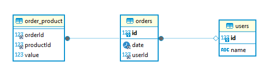

# Desafio técnico - Vertical Logística

Esse projeto tem como objetivo resolver o desafio proposto em um processo seletivo.

## Modo de uso

1. Clonar projeto do github.
1. Executar o `docker compose up -d --build`
1. Acessar a api via `http://localhost` nas rotas a seguir:
    1. POST - `/orders/upload` - rota para carregar os arquivos do sistema legado. Chamar conforme exemplo a seguir com o curl:

        ```shell
        # data_1.txt
        curl -v -F orders=@data/data_1.txt http://localhost/orders/upload

        # data_2.txt
        curl -v -F orders=@data/data_2.txt http://localhost/orders/upload
        ```

    1. GET - `/orders/:id` - rota para recuperar os dados de um pedido pelo id
    1. GET - `/orders` - rota para filtrar os pedidos. Filtros disponíveis:
        1. `/orders?order_id=1` - filtro pelo id do pedido
        1. `/orders?start_date=2021-11-01&end_date=2021-11-20` - filtro pela data do pedido

## Sobre o projeto

O projeto foi desenvolvido utilizando o `typescript` e o `nestjs` como framework web.

O typescript foi escolhido por trazer a tipagem ao javascript. Essa abordagem traz mais qualidade ao código, informando ao desenvolvedor o que é esperado e retornado por cada função além de trazer o poder da compilação que consegue prevenir erros no projeto em tempo de código.

O nestjs é um framework web que vem ganhando popularidade e traz algumas ferramentas interessantes para um código de boa qualidade, como injeção de dependência, o que possibilita utilizar bons padrões de desenvolvimento.

A arquitetura adota no projeto foi a de três camadas: controller, service, repository.

1. O controller é responsável por manipular as requisições HTTP. Nessa camada que encontramos o tratamento dos dados recebidos no request, e definimos a resposta. Essa é a camada que o usuário tem acesso. E a partir dela são acessada a camada de service.

2. O service é a camada responsável por conter as regras de negócio. Nesse projeto foi onde foi implementado o tratamento dos dados recebidos dos arquivos (data_1 e data_2), além de orquestrar as chamadas para os repositórios. Essa é a camada que faz o meio campo entre controller e repository.

3. A camada repository é onde encontramos a integração com sistemas externos. No caso desse projeto temos a integração com o banco de dados.

Essa separação em três camadas melhora a organização do projeto e facilita a manutenção, pois essa arquitetura favorece a adoção dos princípios de responsabilidade única e inversão de dependência.

Esse projeto teve uma adoção baixa de interfaces, pois não senti a necessidade de explorar múltiplas implementação pra nenhuma das possíveis interfaces que o projeto necessitava. Mas caso houvesse alguma necessidade nesse sentido, seria esse o caminho adotado.

### Banco de dados

Para armazenamento dos dados, foi escolhido o banco de dados mysql, que é um banco robusto e bem testado. Para tal foi adotado a modelagem a seguir:



### Infra estrutura

Essa versão do projeto está sendo executada através de container orquestrados pelo docker. O projeto está utilizando o `docker compose` para subir os container do mysql, e do app.

Essa abordagem de conteinerização padroniza o ambiente de execução além de facilitar a implantação em ambiente produtivo. Outra vantagem da abordagem de container é isolação que cada container tem em relação aos demais e ao host.

Por fim, foi adicionado o nginx como proxy/loadBalance que faz com que o sistema possa ser escalável além de garantir alta disponibilidade, graças a possibilidade de ter mais de um pod do app.
